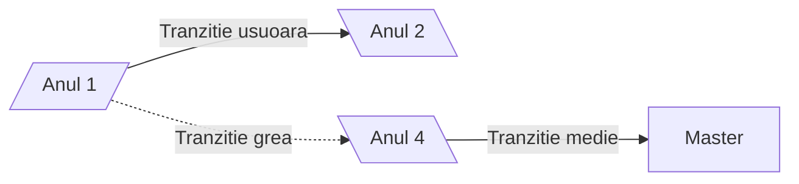

# Diagrame de tip _Flowchart_ 
# Diagarme de tip `Flowchart` 



**De retinut:**

-diagramele _flowchart_ au noduri si conectori
-nodurile au:
  - forma (data de parantezele folosite la descrierea _nodului_
  - ID (sirul folosit in afara descrierii nodului)
  - descrierea (textul ce apare in caseta nodului si care este in interiorul diferitelor tipuri de paranteze - ce decid forma casetei nodului)

 -Conectorii au:
  -diferite tipuri de sageti sau chiar pot activa fara sageti
  -diferite tipuri de linii
    -`-->` linie continua(sageata dreapta)
    - `--` linie continua fara sageti
    - `<-->` linie continua(sageti stanga si dreapat)
    - `==>` linie ingrosata cu sageata spre stanga

# DIAGRAME FLOWCHART AVANSATE
flowchart LR
```
A & B --> C & D & E --> F & G
```
# Diagrame de tip _Timeline_

```mermaid

timeline
title ''My timeline''
section ''sectiunea 1''
2023-2024
:am luat la facultate
:am luat contact cu mediul academic
2024-2025
:am terminat anul 1
:am facut practica
section ''sectiunea 2''
:am facut practica la Fotogrametrie
2026-2027
:am anul terminat 4: am terminat facultatea


    


    


